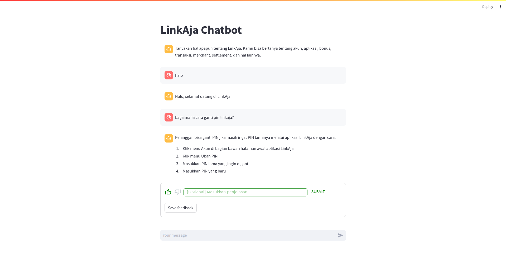

# LinkAja Chatbot

This repository contains the implementation of a chatbot that uses Google's Gemini LLM and ChromaDB to handle Q&A related to LinkAja. The chatbot processes user queries and provides relevant answers based on a pre-defined collection of question-answer pairs.



## Directory Structure

```
linkaja-chatbot
├── wrapper.py
├── src
│   ├── collection_management.py
│   ├── embedding_function.py
│   └── qa_processor.py
└── services
    └── app.py
```

- `wrapper.py`: Script to handle inference from the command line.
- `src/collection_management.py`: Module for managing collections in ChromaDB.
- `src/embedding_function.py`: Module for generating embeddings.
- `src/qa_processor.py`: Module for processing questions and answers.
- `services/app.py`: Script to run the simulation service.

## Setup Instructions

### Cloning the Repository

Before running any scripts, clone the repository to your local machine:

```bash
git clone https://github.com/agustyawan-arif/linkaja-chatbot.git
cd linkaja-chatbot
```

### Environment Variables

Ensure you have your Google Gemini API key set up. Open a `.env` file in the root directory of the project and add your API key:

```
GEMINI_API_KEY=your_api_key_here
```

### Creating the Collection

Before running the simulation service, you need to create the collection. This step only needs to be performed once.

1. Load environment variables.
2. Use the `CollectionManagement` class to create and insert document into collection.

You can do this by running the following commands in a Python shell:

```python
from dotenv import load_dotenv
load_dotenv()
from src.collection_management import CollectionManagement

cm = CollectionManagement()
cm.create_collection("linkaja_pair_question_answer.json", "linkaja")
cm.insert_document()
exit()
```

## Running the Chatbot

### Inference

To perform inference and get answers from the chatbot, use the following command:

```bash
python3 wrapper.py --query "your_query_here"
```

### Running the Simulation Service

To start the simulation service, run:

```bash
python3 services/app.py
```

This will start the service and allow you to interact with the chatbot.
